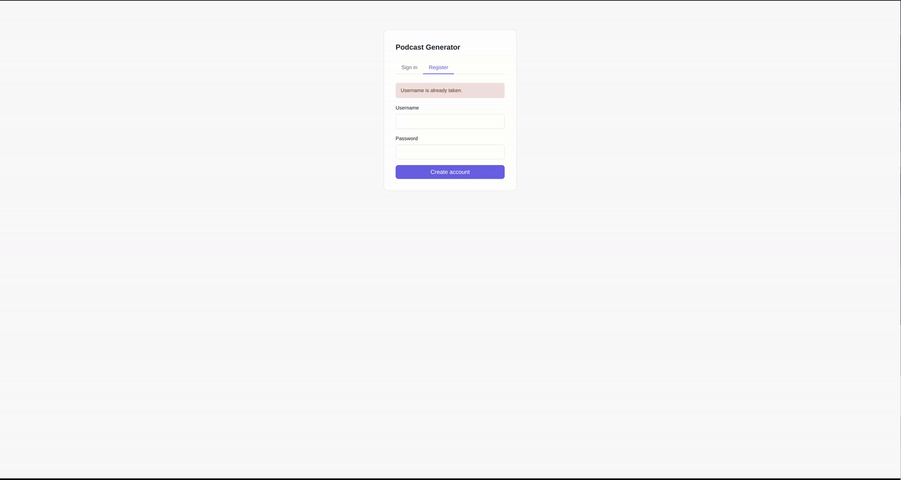

# Podcast Generator

[](https://github.com/Drakon4ik-Coder/PodcastGenerator/actions/workflows/ci.yml)

A self-hosted text-to-speech web app powered by [Kokoro](https://github.com/hexgrad/kokoro). Paste text, hit Generate, and listen as audio streams in real time — each sentence highlighted as it plays. All recordings are saved to your personal library.

**Live demo: [podgen.drakon4ik.uk](https://podgen.drakon4ik.uk)**



---

## Features

- **Real-time streaming** — audio segments stream to the browser via SSE as they are synthesised; no waiting for the full file
- **Live transcript sync** — the active sentence is highlighted using the Web Audio API clock, not the `<audio>` element, so it stays accurate even during buffering
- **Recordings library** — all generations are saved as WAV files, browsable on your account page with captions and click-to-seek
- **Rename & delete** — manage your recordings directly from the browser
- **User accounts** — JWT-based auth with HTTP-only cookies; each user's audio is isolated
- **Docker-first** — one `docker compose up` command gets you running; model weights are cached in a persistent volume

---

## How it works

```
Browser → POST /api/tts/generate (JSON)
       ← SSE stream of base64 WAV chunks
          ↓ scheduled with Web Audio API
          ↓ transcript highlighted in real time
       ← done event with audio_id
          ↓ full WAV saved to /data/audio/
```

The Kokoro TTS pipeline runs in a background thread and pushes segments to an `asyncio.Queue`, bridging its synchronous generator to the async FastAPI endpoint.

---

## Getting started

### Prerequisites

- Docker and Docker Compose **or** Python 3.12+ with `espeak-ng` and `libsndfile1`
- On first run, Kokoro downloads its model weights (~1 GB) from Hugging Face — an internet connection is required

### Docker (recommended)

```bash
git clone https://github.com/Drakon4ik-Coder/PodcastGenerator.git
cd PodcastGenerator

cp .env.example .env
# Edit .env and set a strong SECRET_KEY

docker build -t podgen:latest .
docker compose up -d
```

Open [http://localhost:8000](http://localhost:8000) and register an account.

> The `./data` directory stores the SQLite database, audio files, and the Hugging Face model cache. Back it up to preserve your recordings.

### Local development

```bash
# System dependencies (Debian/Ubuntu)
sudo apt-get install -y espeak-ng libsndfile1

git clone https://github.com/Drakon4ik-Coder/PodcastGenerator.git
cd PodcastGenerator

python -m venv .venv
source .venv/bin/activate
pip install -r requirements.txt
pip install -r requirements-dev.txt

cp .env.example .env   # set SECRET_KEY

uvicorn app.main:app --reload
```

---

## Configuration

Copy `.env.example` to `.env` and set the variables:

| Variable | Default | Description |
|---|---|---|
| `SECRET_KEY` | `change-this-secret-key` | JWT signing key — **change this in production** |
| `DB_PATH` | `podcast.db` | SQLite database path |
| `AUDIO_DIR` | `storage/audio` | Directory for generated WAV files |
| `TTS_VOICE` | `af_heart` | Kokoro voice name |

The Docker image overrides `DB_PATH`, `AUDIO_DIR`, and `HF_HOME` to point to `/data/*` so everything is in the persistent volume.

---

## Running tests

```bash
pip install -r requirements-dev.txt
pytest tests/ -v
```

The test suite mocks the Kokoro pipeline so no model download is needed. 68 tests cover auth, TTS streaming, audio CRUD, and database migrations.

---

## Project structure

```
app/
  main.py          # FastAPI routes
  auth.py          # JWT + password hashing
  database.py      # SQLite init and context manager
  tts.py           # Kokoro wrapper (lazy singleton)
templates/         # Jinja2 HTML templates
static/css/        # Stylesheet
tests/             # Pytest integration tests
Dockerfile
docker-compose.yml
```

---

## Deployment

The included GitHub Actions workflow (`.github/workflows/ci.yml`) runs tests on every push and deploys to production on merge to `main` via rsync over a Cloudflare SSH tunnel.

To deploy to your own server you need three GitHub Actions secrets:

| Secret | Value |
|---|---|
| `DEPLOY_SSH_KEY` | Private key for the `deployer` user (ed25519) |

The workflow syncs the repository, then runs `docker build -t podgen:latest . && docker compose up -d` on the server.

---

## Limitations

- Single-worker Uvicorn — suitable for personal use; not designed for many concurrent users
- Kokoro runs on CPU by default; GPU support requires a CUDA-enabled image
- Audio is stored as uncompressed 24 kHz WAV — disk usage grows with usage

---

## Contributing

1. Fork the repository and create a feature branch
2. Run the test suite (`pytest tests/ -v`) — all tests must pass
3. Open a pull request against `main`; CI will run automatically

Please keep changes focused and commit messages in the `type(scope): sentence.` format used throughout the history.

---

## Support

- **Bug reports & feature requests** — [open an issue](https://github.com/Drakon4ik-Coder/PodcastGenerator/issues)
- **Kokoro TTS** — [hexgrad/kokoro](https://github.com/hexgrad/kokoro)

---

## Maintainer

Built and maintained by [@Drakon4ik-Coder](https://github.com/Drakon4ik-Coder).
